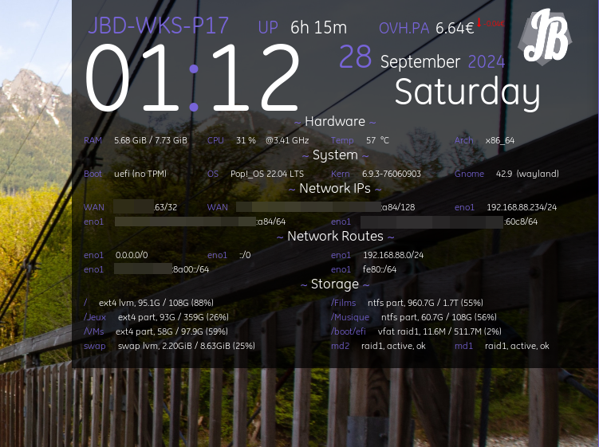

# conky-scripts

Lua helper for conky script



## Installation

Clone this repo to `~/.config/conky/JayBeeDe`

```bash
sudo apt-get install lua-json lua-socket lua-sec
git clone git@github.com:JayBeeDe/conky-scripts.git ~/.config/conky/JayBeeDe
ln -s ~/.config/conky/JayBeeDe ~/.config/conky/default
```

Install required font dependency from third-part website:

```bash
mkdir -p "$HOME/.local/share/fonts/"
curl -sSL "https://font.download/dl/font/ge-inspira.zip" -o "/tmp/ge-inspira.zip"
unzip "/tmp/ge-inspira.zip" -d "$HOME/.local/share/fonts"
chmod +x "$HOME/.local/share/fonts"
rm -f "/tmp/ge-inspira.zip"
```

Then start script with following command:

```bash
cd $HOME/.config/conky/default
conky --config=default.conf --alignment=top_right -x 5
```

Make ajustements, when you are satisfied and that console doesn't show any dependencies issues, you can configure it to start automatically at session start by adding the following file into `~/.config/autostart/conky.desktop`:

```ini
[Desktop Entry]
DBusActivatable=false
Exec=bash -c "cd $HOME/.config/conky/default; conky --config=default.conf --alignment=top_right -x 5 --daemonize"
Icon=Conky
Name=Conky
Name[en_US]=Conky
Name[fr_FR]=Conky
NoDisplay=false
StartupNotify=true
Terminal=false
Type=Application
Version=1.0
```
